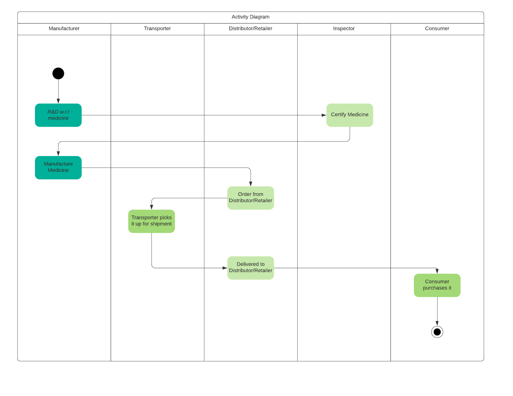
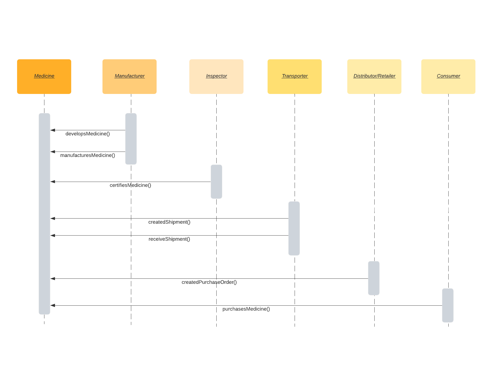
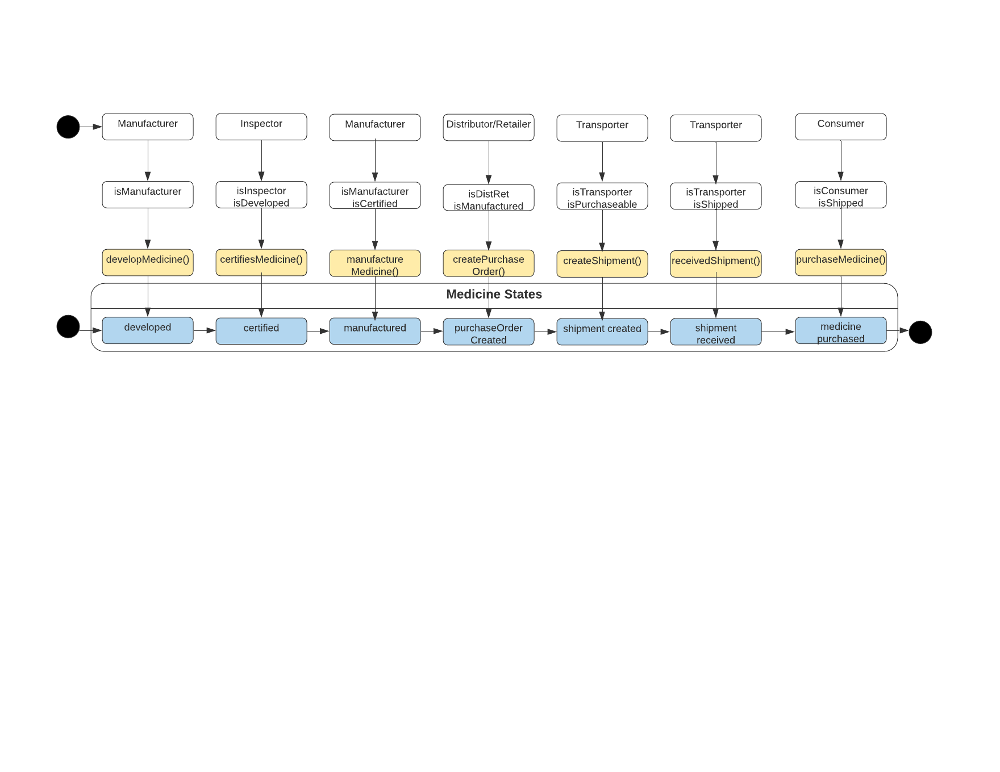
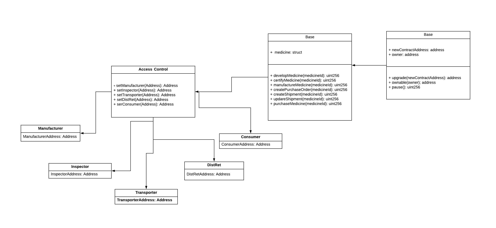

# PharmaChain Architecture - Ethereum Dapp for Tracking Items through Supply Chain

### UML

Definitions:

Choosen supply chain: Medicine

| UML entity  | Details |
|:-------:|:--------|
| Asset | Medicine |
| Attributes | Medicine: - Product Id - Name - Manufacturer - Manufacturing Date - Expiry Date - Owner - Shipment - Authenticity Third-party certifying body: CDSCO etc.  |
| Business Actions | R&D Authenticity Certifying Production Distribution  |
| Role Permissions | Manufacturer Inspector Distributor Retailer Transporter Buyer |

#### Activity Diagram

#### Sequence Diagram

#### State Diagram

#### Class Diagram

### Libraries

If libraries are used, the project write-up discusses why these libraries were adopted.

 - node v14.4.0
 - truffle v5.4.13
 - web3 v1.2.4

### IPFS

`IPFS was not used`

### Project write-up

`Note:- Distributor/Retailer roles are not considered separate roles since they are interchangeable in nature`

### “Contract Address” and “Transaction Hash” on the Rinkeby Network

- Contract Address :- `0x2E8Df59Ecd011E7e0A7Fb0f5DEbE3aa614AFE0df`
- Transaction Hash :- `0xa44d40c66f274772ccc7b270b3af32a23b9c0028e9c05b218cf629bfb2582e0c`

